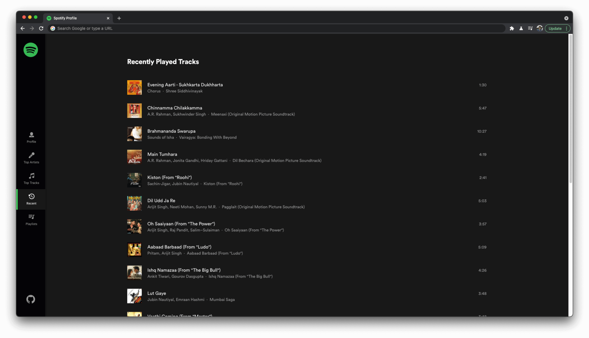
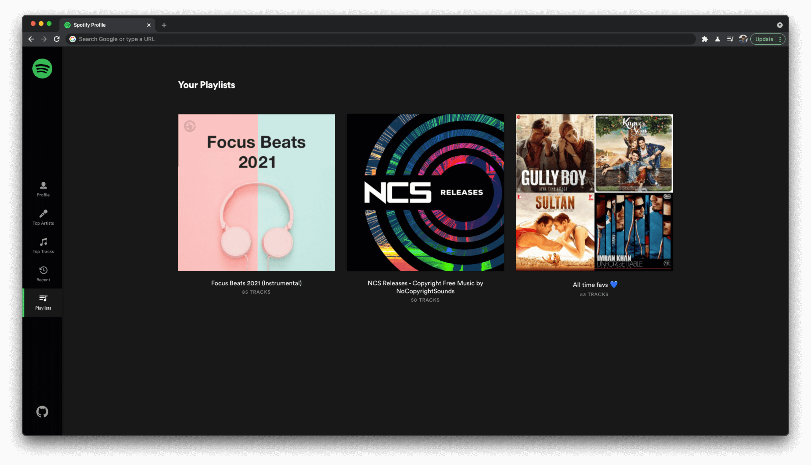

# Spotify Profile App

## https://spotify-profile-app.netlify.app/

 
 
 
A Spotify Profile overview app which will fetch a Spotify user's info, recent activity, favorite tracks, favorite artists, and playlists.

- Project Setup (install Router, Redux, Redux toolkit etc.)
- Auth Flow setup: Required for other screens
- Login Page: Layout of the page and on button click link the auth flow
- Profile Page
- Top Artists Page with filters
- Top Tracks Page with filters

## Screenshots

1. Login Page
   

2. Profile Page
   

3. Top Artists Page with filters
   

4. Top Tracks Page with filters
   

5. Recent activity (**Stretch**)
   

6. Playlists (**Stretch**)
   
